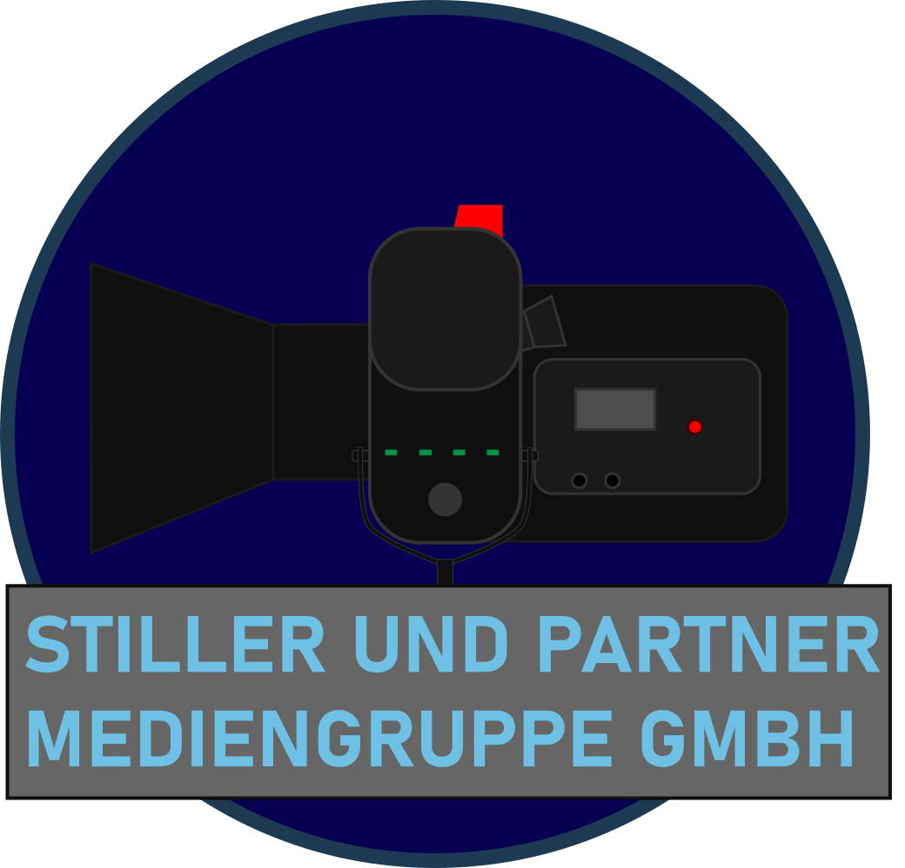

:doctype: book
:toc: macro
:toclevels: 5
:source-highlighter: highlight.js
:icons: font
// Lade die entsprechende Kopfzeile (kopfzeile_diplomarbeit_aul, ..._hif oder ..._kolleg)
//:header_image: kopfzeile_diplomarbeit_aul.png
:pdf-page-size: a4
:toc-title: Inhaltsverzeichnis
:lang: DE
:hyphens:
:author: Sebastian Stiller
:docdate: {docdate}
:title: SPMG-Unternehmensgründungskonzept
:title-logo-image: 
:imagesdir: images

= Unternehmenskonzept Stiller und Partner Mediengruppe GmbH/Holding (SPMG)
{author} +
In der Fassung vom {docdate}

toc::[levels=3]

== Vorwort
Die Stiller und Partner Mediengruppe GmbH/Holding (SPMG) ist ein innovatives Medien und Unterhaltungsunternehmen, das sich auf die Entwicklung und Produktion von hochwertigen Multi-Medialen Inhalten spezialisiert hat. In diesem Dokument werden die genauen Pläne und Ziele zur Gründung der SPMG dargelegt. Hier wird die Geschichte hinter der Idee, die Visionen, der Aufbau und unser Auftrag als Dienstleister und Arbeitgeber beschrieben. Es werden die Produkte und Projekte vorgestellt, welche unser Kerngeschäft bilden, sowie die Werte, welche wir als Unternehmen vertreten. Zudem werden die Ziele und Strategien erläutert, welche wir verfolgen, um unsere Vision zu verwirklichen. Dieses Dokument dient als Leitfaden für die Gründung und Entwicklung der SPMG und soll potenziellen Investoren, Partnern und Mitarbeitern einen umfassenden Einblick in unser Unternehmen geben.

=== Haftung und Geheimhaltung
Die Informationen in diesem Dokument sind vertraulich und dürfen nicht ohne ausdrückliche schriftliche Genehmigung der Stiller und Partner Mediengruppe GmbH/Holding (SPMG), vertreten durch den Gründer und Chief Creative Officer (CCO) **Sebastian Andreas Stiller**, an Dritte weitergegeben oder veröffentlicht werden. 

=== Urheberrecht und geistiges Eigentum

**Alle Inhalte**, einschließlich, aber nicht beschränkt auf **Texte**, **Grafiken**, **Bilder**, **Logos**, **Marken**, **Designs**, **Software** und andere Materialien in diesem Dokument oder anderen Veröffentlichungen sind Eigentum der SPMG, vertreten durch den Gründer und CCO **Sebastian Andreas Stiller**, und sind durch Urheberrechtsgesetze und andere geistige Eigentumsrechte geschützt. 

Die SPMG, vertreten durch den Gründer und CCO **Sebastian Andreas Stiller**, behält sich alle Rechte vor, die nicht ausdrücklich in diesem Dokument gewährt werden. Jede unautorisierte Nutzung, Vervielfältigung, Verbreitung oder Veröffentlichung von Inhalten aus diesem Dokument oder anderen Veröffentlichungen der SPMG, vertreten durch den Gründer und CCO **Sebastian Andreas Stiller**, ist strengstens untersagt und kann rechtliche Konsequenzen nach sich ziehen.

=== Marken und Logos
SPMG und das SPMG-Logo sind eingetragene Marken der Stiller und Partner Mediengruppe GmbH/Holding (SPMG), vertreten durch den Gründer und CCO **Sebastian Andreas Stiller**. Alle anderen in diesem Dokument oder anderen Veröffentlichungen der SPMG, vertreten durch den Gründer und CCO **Sebastian Andreas Stiller**, erwähnten Markennamen, Produktnamen, Dienstleistungsmarken oder Firmennamen sind Eigentum ihrer jeweiligen Inhaber.

=== Haftungsausschluss
Die Informationen in diesem Dokument werden "wie besehen" bereitgestellt, ohne jegliche ausdrückliche oder stillschweigende Gewährleistung. Die SPMG, vertreten durch den Gründer und CCO **Sebastian Andreas Stiller**, übernimmt keine Verantwortung für die Genauigkeit, Vollständigkeit oder Aktualität der Informationen in diesem Dokument oder anderen archivierten Veröffentlichungen. Jegliche Nutzung der Informationen in diesem Dokument ab Veröffentlichung erfolgt auf eigenes Risiko.

== Kontakt 
Für weitere Informationen oder Anfragen bezüglich der Stiller und Partner Mediengruppe GmbH/Holding (SPMG) können Sie uns unter den folgenden Kontaktdaten erreichen:

Ansprechpartner: **Sebastian Andreas Stiller** (Gründer und Chief Creative Officer - CCO)

* **Adresse**: To be Announced
* **Telefon**: +43 660 2084555
* **E-Mail**: mailto:kontakt@sebastianstiller.at[kontakt@sebastianstiller.at]

include::chapters/Intro_History.adoc[leveloffset=+1]

include::chapters/Executive_Summery.adoc[leveloffset=+1]

include::chapters/Compliance_HR_Finance.adoc[leveloffset=+1]

include::chapters/Products_Projects.adoc[leveloffset=+1]

include::chapters/GuestServices_Hospitality.adoc[leveloffset=+1]

include::chapters/Operations_Security.adoc[leveloffset=+1]

include::chapters/Operations_Medical.adoc[leveloffset=+1]

include::chapters/ERPDS_System.adoc[leveloffset=+1]

include::chapters/ERPDS_System_MobileApp.adoc[leveloffset=+1]

include::chapters/requirements.adoc[leveloffset=+1]

include::chapters/Paysystem.adoc[leveloffset=+1]

include::chapters/Uniform_corporate_identity.adoc[leveloffset=+1]

include::chapters/Vehicles_fleet.adoc[leveloffset=+1]

include::chapters/Company_agreement.adoc[leveloffset=+1]

